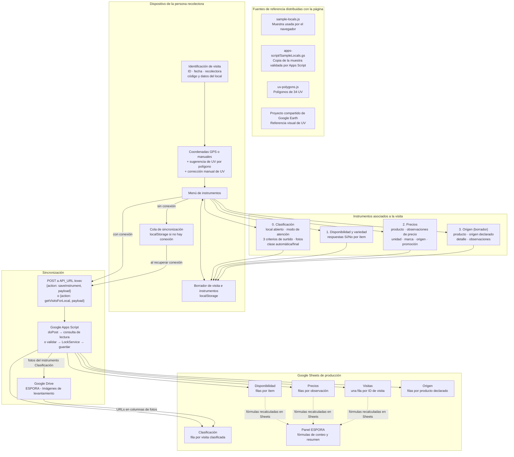
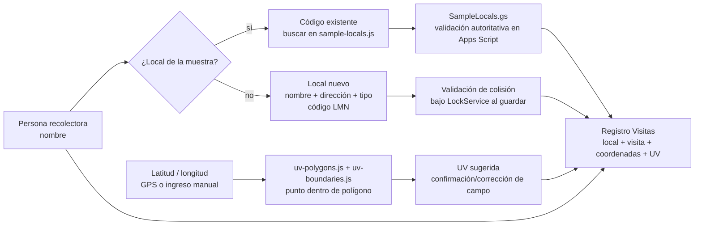
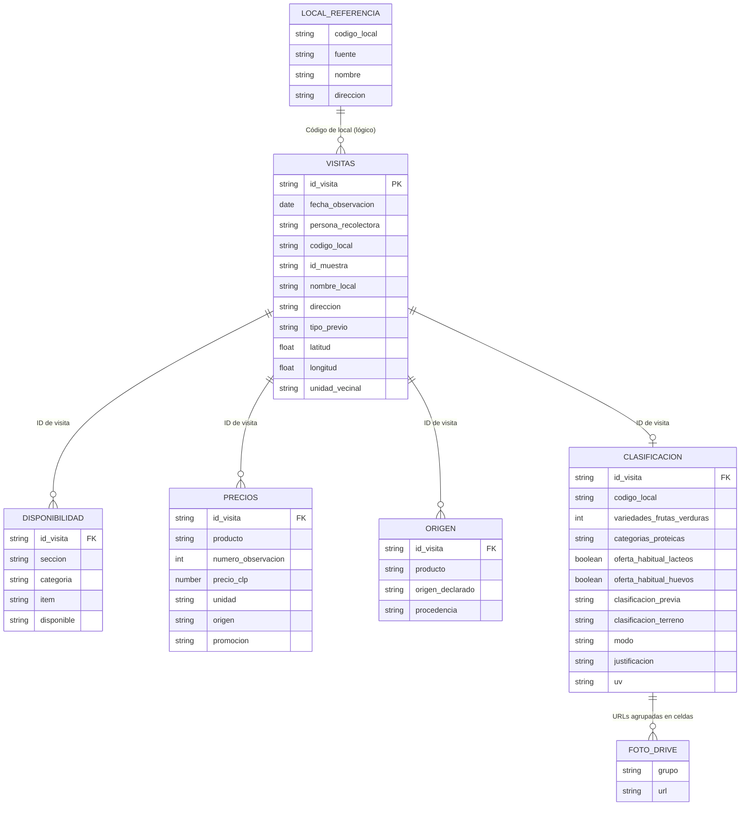
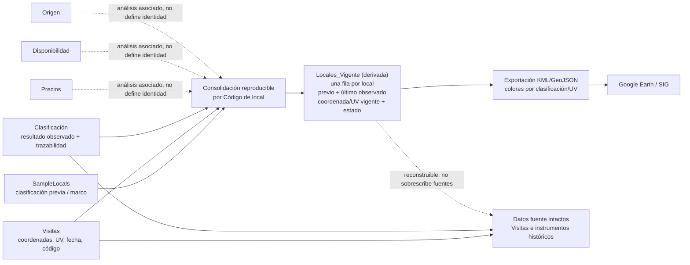

# Flujo de información de ESPORA

Este documento describe el comportamiento implementado en el repositorio a fecha 2026-09-29 y separa ese flujo del diseño futuro recomendado para consolidar locales y generar mapas. No crea ni sincroniza datos: sirve como plano de trabajo para decidir la siguiente etapa.

## 1. Flujo general implementado

La base está identificada en `Code.gs` por Spreadsheet ID `1kgIi0Ls6zaSfFZI8ToXHS6Kil610z73m1jqoCZwZQ_Y`. Apps Script escribe en las cinco hojas de captura; `Panel ESPORA` se crea por `setupDatabase()` y sus fórmulas resumen los datos de las hojas, no recibe cada envío como una tabla transaccional.

## 2. Identificación, fuentes del local y geografía

- `sample-locals.js` y `apps-script/SampleLocals.gs` son copias del catálogo de muestra para dos capas distintas: selección en el navegador y validación/enriquecimiento en el backend. No son una tabla maestra sincronizada.
- Un local nuevo **no se inserta** en esas copias. Sus datos viajan con la visita y se escriben en `Visitas` y, para Clasificación, también en esa hoja con el código del local.
- El código de local nuevo incorpora iniciales, derivadas automáticamente del nombre de la persona recolectora, para separar los espacios de numeración offline. Apps Script comprueba que el código no esté asociado a otro nombre; una revisita al mismo local puede conservarlo.
- Las iniciales identifican el espacio de códigos, pero no se almacenan como columna aparte en `Visitas`; la hoja conserva el nombre de la recolectora y el código del local.
- El GPS no asigna la UV por proximidad a un punto de muestra: `uv-boundaries.js` prueba la coordenada contra los polígonos de `uv-polygons.js`. La sugerencia se puede corregir manualmente y se guarda la UV elegida en la visita.
- El botón de Google Earth abre un mapa compartido de referencia. **No** publica ni actualiza registros de ESPORA en ese mapa.

## 3. Qué registra cada instrumento

Todos los envíos llevan el mismo objeto `visit` y se relacionan por `ID de visita`. El backend guarda el contenido en una hoja distinta por instrumento. Si se vuelve a guardar el mismo instrumento para el mismo ID de visita, reemplaza sus filas anteriores; no conserva versiones históricas de cada edición.

Para retomar una visita en otro dispositivo, la persona busca por código de local y una clave compartida del equipo. La acción `getVisitsForLocal` verifica la propiedad de Apps Script `ESPORA_RESUME_ACCESS_CODE`, consulta las filas de `Visitas` y las cuatro hojas de instrumentos, devuelve las visitas coincidentes con sus pautas guardadas y no escribe ni cambia el esquema. Al seleccionar una, el frontend guarda la copia completa en el navegador y mantiene el mismo `ID de visita`; las pautas siguientes se enlazan por ese ID. La clave no se persiste en el navegador. La búsqueda requiere conexión; después de cargarla, el borrador local puede seguir usándose sin internet y las nuevas pautas se sincronizan al recuperar conexión.

Sin conexión, el payload del instrumento queda en la cola local del dispositivo. La aplicación intenta vaciarla al recuperar conexión y al iniciar. Si un envío de la cola falla, no retira ese payload ni los que vienen detrás. Cada payload incluye `responsible`, la persona responsable de esa pauta.

| Instrumento | Datos que captura | Forma de persistencia |
|---|---|---|
| **Identificación / visita** (página inicial) | ID de visita; fecha de observación; persona que identifica el local (columna `Persona recolectora`); código, ID de muestra, nombre, dirección, tipo/subtipo (heredado de la muestra y guardado, pero **no mostrado** en pantalla; en locales nuevos el tipo es «Almacén o minimarket»); latitud/longitud levantadas; UV. Las iniciales usadas al generar códigos no son una columna de Sheets. La pantalla inicial también permite buscar visitas por código y retomar una copia. | `Visitas`: una fila por ID de visita, actualizada si el mismo borrador se sincroniza de nuevo. `getVisitsForLocal` solo lee las hojas existentes; al retomar se conserva ese ID. |
| **1. Clasificación (opcional)** | Persona responsable; estado abierto; superficie (góndolas); sistema de atención (autoservicio, tras mesón o mixto); rubros observados con número de variedades de frutas/hortalizas y tipos de carne; pescados y mariscos congelados; lácteos; huevos; clasificación automática/final; modo/justificación manual; observaciones; fotos de frontis, interior autorizado y módulos opcionales (incluye pescados y mariscos). | `Clasificación`: fila asociada al ID de visita y código de local. Minimarket requiere autoservicio o mixto (mixto pesa como autoservicio) y al menos 2 de 3 criterios: ≥10 variedades de frutas/hortalizas, 2+ categorías entre vacuno/cerdo/pollo/cordero/pescados o mariscos, lácteos y huevos. `Superficie estimada`, `Fruta y verdura`, `Carnes` y `Otros rubros` vuelven a llenarse; `Abarrotes básicos` queda vacía. Al final: `Fotos pescados y mariscos` y `Persona responsable`. Archivos van a Drive; las URL quedan en la hoja. |
| **2. Disponibilidad y variedad** | Persona responsable; respuesta Sí/No por cada ítem de la pauta de disponibilidad, preparaciones y variedad. | `Disponibilidad`: varias filas por visita, una por ítem con sección, categoría, texto, respuesta y persona responsable. |
| **3. Origen** | Persona responsable; productos con evidencia de origen regional: categoría alimentaria, variedad, comuna de Aysén, sector o localidad, marca o productor, fuente de evidencia y observaciones; o la marca «sin productos regionales observados». | `Origen`: una fila por producto. Las columnas antiguas reciben un resumen (`Producto` = categoría: variedad; `Origen declarado` = comuna; detalle = sector · marca) y los campos nuevos quedan en columnas dedicadas al final. |
| **4. Precios** | Persona responsable; alimentos centinela (18) con precio mínimo obligatorio y máximo opcional; marca, precio CLP, unidad (kg, 0,5 kg, Unidad, Otros), oferta, observaciones. | `Precios`: una fila por precio, con `Tipo de precio (mínimo/máximo)` y `Persona responsable` al final. Las columnas de conservación y origen quedan vacías en registros nuevos. |

Las hojas `Disponibilidad`, `Precios`, `Origen` y `Clasificación` tienen la columna `ID de visita` como clave de relación con `Visitas`. Para consolidar por establecimiento se debe usar además `Código de local`: una visita no equivale a un local, porque el mismo local puede tener varias visitas.

## 4. Modelo de datos que existe hoy

`FOTO_DRIVE` es una relación conceptual para representar los archivos externos: en la implementación no hay una hoja/tabla de fotos y las URLs de cada grupo se concatenan en una celda de la fila `Clasificación`. `LOCAL_REFERENCIA` representa el catálogo de muestra, no una hoja maestra desplegada: actualmente sus valores viven en los dos archivos `SampleLocals`. Tampoco existe hoy una hoja `Locales_Vigente` ni una función que consolide las distintas visitas.

## 5. Siguiente etapa recomendada: consolidación y mapa

La capa derivada permitiría comparar **clasificación previa** (`criterion`/`criterion2` del marco) con **clasificación de terreno** (última visita clasificada), mostrar locales sin visita y producir un KML sin alterar los datos fuente. Antes de implementarla hay que acordar:

1. **Identidad y deduplicación:** `Código de local` es la clave operativa actual; definir cómo detectar dos códigos para el mismo comercio o un local que cambió de nombre/dirección.
2. **Qué significa “vigente”:** última visita por fecha de observación, desempate por fecha de registro/ID; decidir si manda el último resultado automático o una corrección manual justificada.
3. **Coordenada maestra:** una visita puede tener un GPS distinto de otra. Definir si el mapa usa la última coordenada, la mediana/promedio, o una coordenada maestra revisada por una persona.
4. **Clasificación previa vs. actual:** conservar ambas como atributos separados; no sobrescribir el marco muestral con lo observado.
5. **Locales nuevos:** incluirlos como entidades de la capa derivada sin agregarlos automáticamente a `SampleLocals.gs`.
6. **Publicación del mapa:** descargar e importar una nueva exportación KML/GeoJSON, o diseñar un endpoint/NetworkLink si el formato y el cliente de Google Earth elegido lo permiten. Actualmente no existe exportador ni sincronización con el proyecto compartido.
7. **Historial y calidad:** preservar todas las visitas como hechos fechados; marcar coordenadas fuera de polígonos, UV corregidas manualmente y posibles duplicados para revisión.

**Regla de seguridad:** generar `Locales_Vigente` y los KML como productos derivados y regenerables. No borrar ni editar `Visitas`, `Clasificación` ni `SampleLocals` para construirlos.
